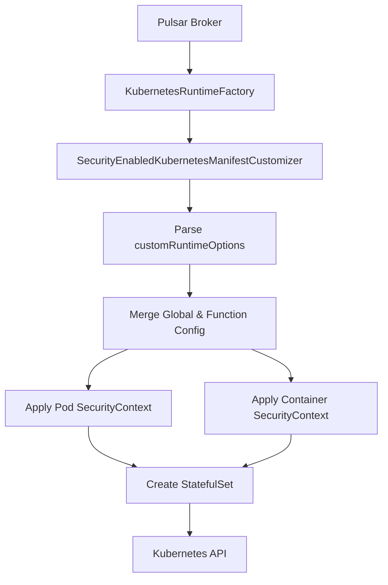

# Pulsar SecurityContext Customizer

A custom Kubernetes Manifest Customizer for Apache Pulsar that adds comprehensive SecurityContext support to Functions and Source/Sink Connectors.

## Overview

The `SecurityEnabledKubernetesManifestCustomizer` extends Pulsar's `BasicKubernetesManifestCustomizer` to support Pod and Container SecurityContext configurations, which are not available in the default implementation.

## Features

### Pod SecurityContext Support
- `runAsUser` / `runAsGroup` - Run containers as specific user/group ID
- `fsGroup` - Set filesystem group ownership for volumes
- `runAsNonRoot` - Enforce non-root execution
- `supplementalGroups` - Additional group IDs
- `fsGroupChangePolicy` - Control how volume ownership is changed
- `seccompProfile` - Seccomp security profile
- `seLinuxOptions` - SELinux security context

### Container SecurityContext Support
- `runAsUser` / `runAsGroup` / `runAsNonRoot` - User/group settings per container
- `readOnlyRootFilesystem` - Make root filesystem read-only
- `allowPrivilegeEscalation` - Control privilege escalation
- `privileged` - Run container in privileged mode
- `capabilities` - Add/drop Linux capabilities
- `procMount` - Control /proc mount type
- `seccompProfile` - Container-level seccomp profile
- `seLinuxOptions` - Container-level SELinux options

## Installation

###1. Build the JAR (Already Done)

The JAR has been built at:
```
/home/jmann/git/pulsar-security-customizer/target/pulsar-security-customizer-1.0.0.jar
```

### 2. Deploy to Pulsar Brokers

Copy the JAR to all Pulsar broker pods:

```bash
# For each broker pod
for i in 0 1 2; do
  kubectl cp /home/jmann/git/pulsar-security-customizer/target/pulsar-security-customizer-1.0.0.jar \
    pulsar/pulsar-broker-$i:/pulsar/lib/pulsar-security-customizer-1.0.0.jar
done
```

### 3. Update Pulsar Configuration

Update your Helm values to use the custom customizer:

```yaml
broker:
  configData:
    # Enable Kubernetes runtime
    functionsWorkerEnabled: "true"
    PF_functionRuntimeFactoryClassName: org.apache.pulsar.functions.runtime.kubernetes.KubernetesRuntimeFactory

    # Configure custom manifest customizer
    PF_kubernetesManifestCustomizerClassName: com.custom.pulsar.SecurityEnabledKubernetesManifestCustomizer

    # Optional: Global security context configuration
    PF_kubernetesManifestCustomizerConfig: |
      {
        "podSecurityContext": {
          "runAsNonRoot": true,
          "runAsUser": 10000,
          "runAsGroup": 10000,
          "fsGroup": 10000
        },
        "containerSecurityContext": {
          "runAsNonRoot": true,
          "readOnlyRootFilesystem": false,
          "allowPrivilegeEscalation": false,
          "capabilities": {
            "drop": ["ALL"]
          }
        }
      }
```

Then upgrade your Helm release:

```bash
helm upgrade pulsar apache/pulsar -n pulsar -f your-values.yaml
```

### 4. Restart Broker Pods

```bash
kubectl rollout restart statefulset pulsar-broker -n pulsar
```

## Usage

### Basic Example with SecurityContext

When creating or updating a Function or Source Connector, add the `customRuntimeOptions` with your SecurityContext configuration:

```bash
# Example: Create Function with SecurityContext
pulsar-admin functions create \
  --tenant public \
  --namespace default \
  --name my-secure-function \
  --jar my-function.jar \
  --classname com.example.MyFunction \
  --custom-runtime-options '{
    "podSecurityContext": {
      "runAsUser": 10000,
      "runAsGroup": 10000,
      "fsGroup": 10000,
      "runAsNonRoot": true
    },
    "containerSecurityContext": {
      "runAsNonRoot": true,
      "readOnlyRootFilesystem": true,
      "allowPrivilegeEscalation": false,
      "capabilities": {
        "drop": ["ALL"]
      }
    }
  }'
```

### Comprehensive SecurityContext Example

```json
{
  "podSecurityContext": {
    "runAsUser": 10000,
    "runAsGroup": 10000,
    "fsGroup": 10000,
    "runAsNonRoot": true,
    "supplementalGroups": [3000, 4000],
    "fsGroupChangePolicy": "OnRootMismatch",
    "seccompProfile": {
      "type": "RuntimeDefault"
    },
    "seLinuxOptions": {
      "level": "s0:c123,c456",
      "role": "system_r",
      "type": "container_t",
      "user": "system_u"
    }
  },
  "containerSecurityContext": {
    "runAsUser": 10000,
    "runAsGroup": 10000,
    "runAsNonRoot": true,
    "readOnlyRootFilesystem": true,
    "allowPrivilegeEscalation": false,
    "privileged": false,
    "capabilities": {
      "add": ["NET_BIND_SERVICE"],
      "drop": ["ALL"]
    },
    "procMount": "Default",
    "seccompProfile": {
      "type": "RuntimeDefault"
    },
    "seLinuxOptions": {
      "level": "s0:c123,c456",
      "role": "system_r",
      "type": "container_t",
      "user": "system_u"
    }
  }
}
```

### Update Existing Debezium Source Connector

To update your existing Debezium PostgreSQL source connector:

```bash
# Get current configuration
pulsar-admin sources get \
  --tenant public \
  --namespace default \
  --name debezium-postgres-source > /tmp/source-config.json

# Add customRuntimeOptions to the JSON (see example below)
# Then update the source
pulsar-admin sources update \
  --source-config-file /tmp/source-config-json
```

Example `customRuntimeOptions` addition:
```json
{
  "tenant": "public",
  "namespace": "default",
  "name": "debezium-postgres-source",
  "...": "... other config ...",
  "customRuntimeOptions": "{\"podSecurityContext\":{\"runAsUser\":10000,\"runAsGroup\":10000,\"fsGroup\":10000,\"runAsNonRoot\":true},\"containerSecurityContext\":{\"runAsNonRoot\":true,\"readOnlyRootFilesystem\":false,\"allowPrivilegeEscalation\":false,\"capabilities\":{\"drop\":[\"ALL\"]}}}"
}
```

### Update Existing Function

```bash
# Update the cdc-enrichment function
pulsar-admin functions update \
  --tenant public \
  --namespace default \
  --name cdc-enrichment \
  --custom-runtime-options '{
    "podSecurityContext": {
      "runAsUser": 10000,
      "runAsGroup": 10000,
      "fsGroup": 10000,
      "runAsNonRoot": true
    },
    "containerSecurityContext": {
      "runAsNonRoot": true,
      "readOnlyRootFilesystem": false,
      "allowPrivilegeEscalation": false,
      "capabilities": {
        "drop": ["ALL"]
      }
    }
  }'
```

## Verification

After updating your Functions or Source Connectors, verify the SecurityContext is applied:

```bash
# Check the StatefulSet for your Function/Source
kubectl get statefulset pf-public-default-debezium-postgres-source -n pulsar -o yaml | grep -A 20 securityContext

# Check the running pod
kubectl get pod pf-public-default-debezium-postgres-source-0 -n pulsar -o yaml | grep -A 20 securityContext

# Verify the user ID inside the container
kubectl exec -n pulsar pf-public-default-debezium-postgres-source-0 -- id
```

Expected output should show:
```
uid=10000 gid=10000 groups=10000
```

## Troubleshooting

### CustomRuntimeOptions Not Working

1. Verify the customizer JAR is in `/pulsar/lib/` on all broker pods
2. Check broker logs for initialization messages:
```bash
kubectl logs pulsar-broker-0 -n pulsar | grep SecurityEnabledKubernetesManifestCustomizer
```

3. Ensure the broker configuration includes:
```yaml
PF_kubernetesManifestCustomizerClassName: com.custom.pulsar.SecurityEnabledKubernetesManifestCustomizer
```

### Pod Fails to Start

If pods fail with permission errors after applying SecurityContext:
1. Check if volumes need specific permissions
2. Verify the user ID exists in the container image
3. Consider using `fsGroup` for volume permissions
4. Check if `readOnlyRootFilesystem` needs to be false for your workload

### JSON Parsing Errors

Ensure your JSON is properly escaped, especially when using `pulsar-admin` CLI:
- Use single quotes around the JSON
- Escape internal double quotes if needed
- Validate JSON syntax before applying

## Architecture



## Contributing

The source code is located at:
- Java class: `/home/jmann/git/pulsar-security-customizer/src/main/java/com/custom/pulsar/SecurityEnabledKubernetesManifestCustomizer.java`
- Maven POM: `/home/jmann/git/pulsar-security-customizer/pom.xml`

To rebuild:
```bash
cd /home/jmann/git/pulsar-security-customizer
mvn clean package -DskipTests
```

## License

This customizer is designed for use with Apache Pulsar 4.0.2 and follows the same Apache 2.0 License.

## References

- [Pulsar Functions Kubernetes Runtime](https://pulsar.apache.org/docs/next/functions-runtime-kubernetes/)
- [Kubernetes SecurityContext](https://kubernetes.io/docs/tasks/configure-pod-container/security-context/)
- [Kubernetes Pod Security Standards](https://kubernetes.io/docs/concepts/security/pod-security-standards/)
